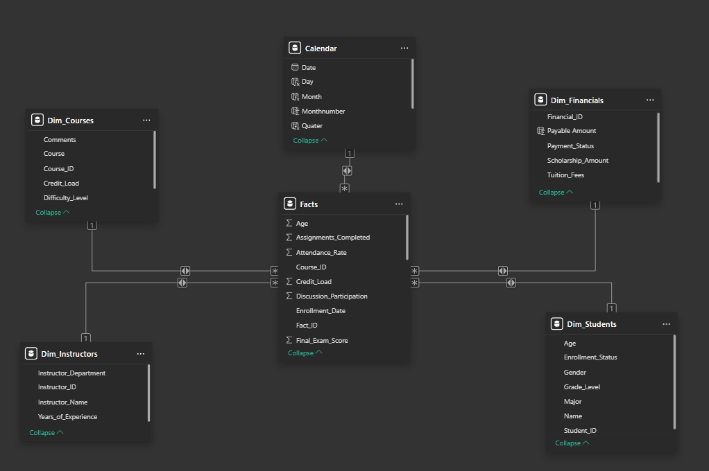
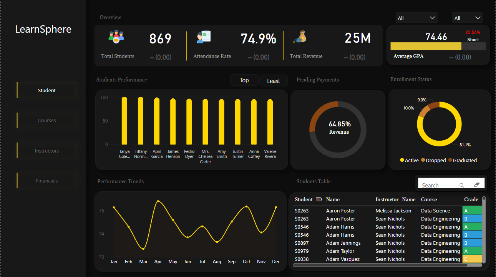
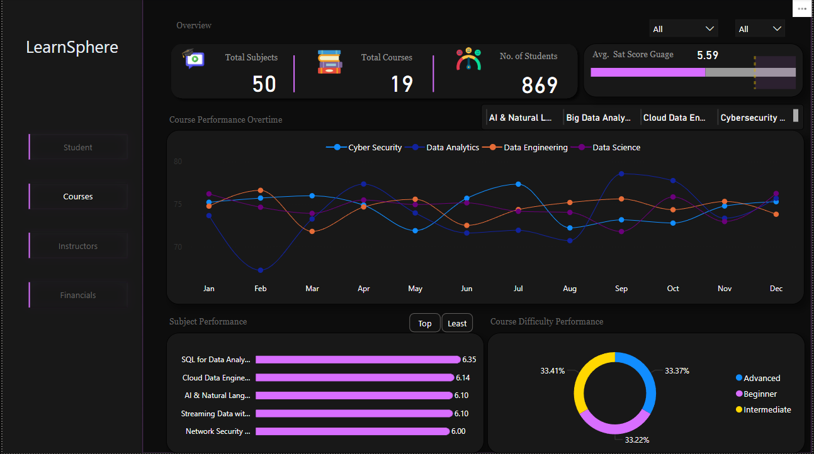
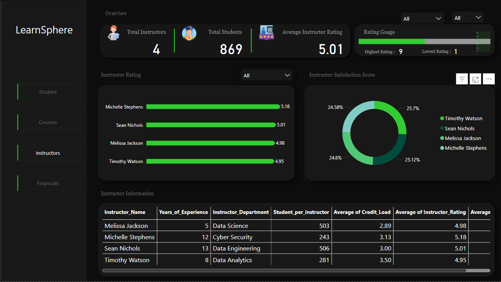
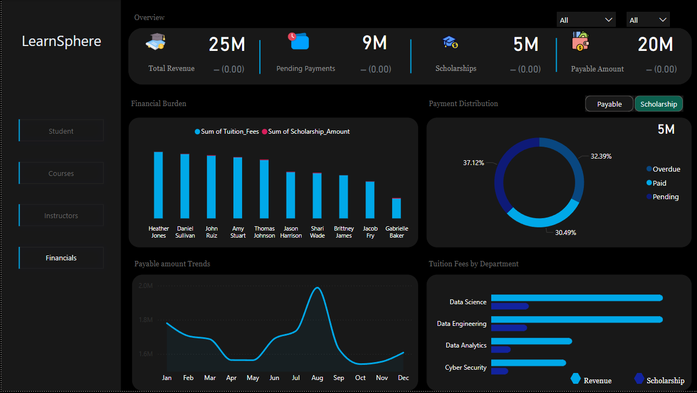
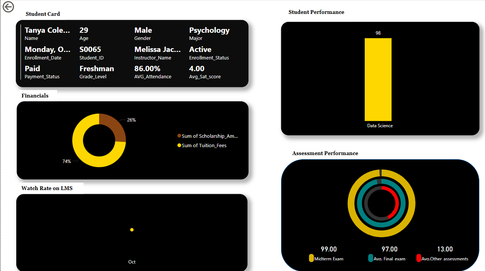
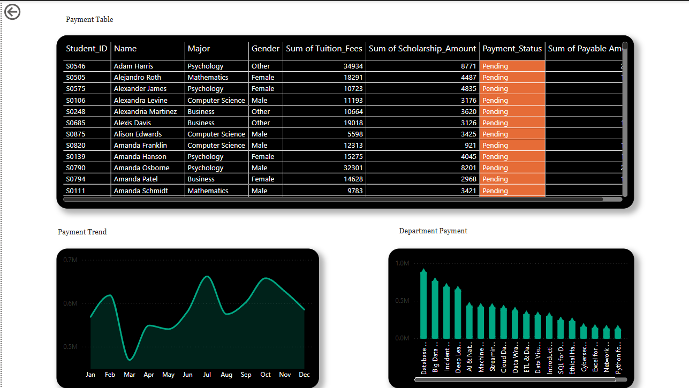

# OVERVIEW

This project showcases a comprehensive Power BI dashboard developed for **LearnSphere**, an online learning platform. 

I led the end-to-end design of a reporting solution that delivers actionable insights across **student lifecycle analytics**, **course performance**, **instructor productivity**, and **institutional financials**.

The goal was to simulate a real-world business case, where decision-makers at an edtech firm need data-driven intelligence to improve academic outcomes, optimize instructor allocation, and ensure sustainable revenue flow.

## 🔗 Live Dashboard

You can interact with the fully published Power BI dashboard here:

[View on Power BI Service](https://app.powerbi.com/view?r=eyJrIjoiNTMzMTQyMDMtYjdlNy00NDMwLWFjYzktZjk1ZGY1NWQ1MWU4IiwidCI6ImZmMGYzZTNhLTNlNTMtNDU0Zi1iMmI1LTZjNjg3NTNiOGVlNCJ9)

> *(Best viewed on desktop for full functionality. Ensure pop-ups are allowed.)*

## Project Objectives

The project was built to address the following business objectives

- What are the **enrollment trends** across months and departments
- What are the students that are *active*,*dropped* or *graduated* and whats their academic performance
- Which **instructors** are driving student success and how do their ratings compare?
- Which courses are *in-demand* and how does course difficulty impact performance?
- How much revenue is being generated? and what are the trends in **pending payments** and **scholarship distribution**

## Tools & Technologies

| Tool | Use |
|------|-----|
| **Power BI Desktop** | Data modeling, dashboard creation |
| **Power Query** | Data transformation and cleaning |
| **DAX** | Business logic and KPIs |
| **Star Schema Modeling** | Scalable, optimized data architecture |
| **Power BI Service** | For live publishing, sharing, and cloud-based report consumption |

## Data Model Overview

The Power BI data model was built using **Star Schema** principles for performance and scalability:

- **Fact Tables**: Student Table
- **Dimension Tables**: Students, Instructors, Courses, Financials.

Below is the image of the Data Model

> All data was cleansed and transformed using **Power Query**. Calculations and KPIs were built using **DAX** to ensure optimized performance and modularity.

## Analytical Approach

### 1. **Student Analytics**

- Monitor Student Metrics: Track total students, attendance, and GPA in real time.

- Performance Evaluation: Identify top and least performing students based on grade for targeted interventions.

- Financial Tracking: Monitor revenue and pending payments to ensure financial stability.

- Student Status Tracking: Visualize the status of students (active, dropped, graduated) for retention analysis.

- Trend Analysis: Observe performance trends over time (e.g., GPA changes) to guide decisions.

- Allow the filtering of the data based on year,students status,top and least perfroming students and also by student name

**Students Analytics**

### 2. **Course Performance Analysis**

- Monitor Course Metrics: Track the number of subjects (50) and courses (19) offered, along with the total number of students (869).

- Course Performance Over Time: Analyze trends in course performance baseed on grades across several months.

- Subject-Specific Performance: Evaluate the performance of specific courses based on satisfaction levels of the students to identify top-performing subjects and subjects that students love the most.

- Course Difficulty Analysis: Assess the difficulty levels of the difeerent courses as assesed from the students to understand how students are interacting with different course levels.

- Allow filtering of the data by courses, year, students status and top and least performing subjects  based on students satisaction levels.

**Course Perforance Analytics**

### 3. **Instructor Performance Analytics**

- Monitor Instructor Metrics: Track total instructors (4) and total students (869), with an average instructor rating (5.01).

- Instructor Performance Evaluation: Show individual instructor ratings to compare performance (Michelle Stephens has the highest rating at 5.18).

- Instructor Satisfaction: Visualize instructor satisfaction scores to understand how students feel about each instructor, helping to identify strengths and areas for improvement.

- Instructor Information: Provide detailed instructor data, including years of experience, department, students per instructor, credit load, and average ratings.

- Allow filtering of the data by instructor name,year and students status to get more deeper iinsights.

**Instructor Performance Analytics**

### 4. **Financial Analytics**

- Track Financial Metrics: Monitor total revenue (25M), pending payments (9M), scholarships (5M), and payable amounts (20M).

- Student Financial Breakdown: Visualize individual contributions to tuition fees and scholarships, helping to identify the largest contributors (e.g., Heather Jones, Daniel Sullivan).

- Payment Distribution: Analyze payment statuses (overdue, paid, pending) with a breakdown to assess financial health and manage collection efforts.

- Payment Trends: Track payable amounts over time to understand seasonal trends in payments and predict future cash flow.

- Department Financials: Analyze tuition fees by department (Data Science, Data Engineering, Data Analytics, Cyber Security) to see where revenue is being generated.

- Allow filtering of the data by year,students status and paybable and scholarship payment distribution.

**Financial Analytics**

## Dashboard Highlights

| Area | Description |
|------|-------------|
| **Students Overview** | Live stats on total students, attendance rate, grade distribution |
| **Course Performance** | Comparative charts for difficulty level, GPA by course, and dropout patterns |
| **Instructor Insights** | Ratings, satisfaction scores, experience distribution, student load |
| **Financials** | Revenue funnel, tuition vs scholarship, overdue payment trends |

### Drillthrough Pages

Drillthrough pages allow stakeholders to right-click and explore **individual student records** or **detailed financial breakdowns**.

#### Student Performance Drillthrough
- View student-level metrics: SAT scores, midterm/final exams, attendance, and academic standing
- Designed for academic advisors and instructors to monitor student success

**Student Drillthrough**

#### Financial Status Drillthrough
- Displays full payment record: tuition fees, scholarships, overdue amounts
- Helps the finance team target students with payment issues

**Financial Drillthrough**

## Key Business Insights

Here are some key takeaways derived from the dashboard:

### 1. Student

Student Performance Monitoring: 869 students are being tracked, with key metrics like attendance (74.9%) and average GPA (74.46). The dashboard helps identify top and low performers for personalized intervention.

Enrollment Status: Majority of students are Active (81.1%), with a small proportion Dropped (9.0%) and Graduated (10.0%), which can inform retention strategies.

Financial Tracking: 64.85% of the revenue is realized, helping track financial health and pending payments.

### 2. Courses

Course Performance: Performance of key courses like Cyber Security, Data Analytics, and Data Engineering fluctuates over time, suggesting the need for ongoing assessment and improvements.

Subject Performance: Courses like SQL for Data Analysis are performing well, students are satisfied and like the course, while others may need additional attention or support.

Course Difficulty Distribution: A balance of difficulty levels (Beginner, Intermediate, Advanced) shows that courses are well-balanced for varying skill levels.

## 3. Instructor

Instructor Performance: Overall instructor ratings are positive, with Michelle Stephens being the highest-rated instructor (5.18). These ratings help identify areas for improvement or reinforcement.

Instructor Satisfaction: The satisfaction distribution across instructors indicates that there is generally positive feedback, but variations suggest room for improvement in certain areas.

Instructor Data: Key metrics such as Years of Experience, Student per Instructor, and Average Instructor Rating provide valuable data for staffing and future assignments.

## 4. Financials

Financial Overview: Total revenue is 25M, with pending payments of 9M and scholarships of 5M. This helps track the financial flow and ensure resources are allocated efficiently.

Payment Trends: Payments fluctuate throughout the year, with some periods experiencing lower payables. Understanding these trends helps anticipate cash flow and plan financial operations.

Tuition Fees by Department: The largest revenue comes from Data Science, followed by Data Engineering, suggesting these departments are key revenue drivers.

Scholarship Allocation: Scholarships make up a portion of the total financial picture, and analyzing their distribution can inform financial aid decisions.

## Future Enhancements

- Add **Row-Level Security (RLS)** for department heads
- Enable **data refresh via Power BI Service**